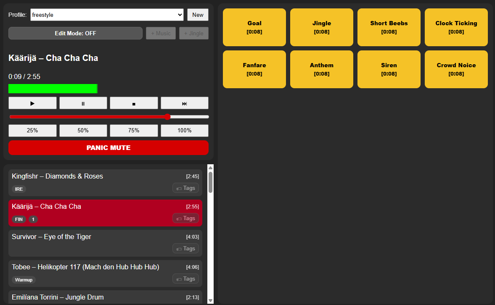

# sport-event-soundboard
This is simple yet powerfull MP3 player for sport events. Software is based on node/electron and tested with MS Windows 11.  

## Features
- User interface is simple, maybe not so fancy looking, but everyone should be able to use it without any training or instructions. Adding files require basic understnading about directories.
- Music files are stored in the program folder, under `/music`
- Jingel files are stored in the program folder, under `/jingles`
- You can create profiles (playlists) for different events e.g. kayaking, foortball, price ceremony, etc. Profile is stored as a JSON file under profiles directory. 
- You can create list of jingles (1-16) for the event e.g. special sound effect for goal, or play national anthem in price ceremony.
- Change of music happens smoothly.
- Playing jingle is silencing music by 50%.
- There is an application programmin interface (API) to control the software from other services, such as Bitfocus Companion and Stram Deck.
- Every music track can have 0..N tags (strings). Tags are per profile (so football profile can have different tags than award ceremony profile). Examples: `"23"`, `"Finland"`, `"Team GB"`, `"Goalkeeper"`, `"Warmup"`



## Installation for development
###
```
npm install
npm install music-metadata
npm start
```

## Packaging “Sport Event Soundboard” as a Windows EXE Installer

### 1. copy software from Github 

### 2. Install electron-builder

I have successfully compiled software to exe with node v22.22.0 and npm version 10.9.4. Latest node version failed.

From your project root:
```
npm install --save-dev electron-builder
npm init
npm run dist
```
If you are lucky, you have `Sport Event Soundboard Setup 1.0.0.exe` in `dist` directory.

Copy your mp3 files to ~/jingles and ~/music.

You can create different profiles using the software, but you can create those manually also (following strict JSON syntax). ~/profiles directory has JSON files to define diferent profiles. Each profile has `{name of the pprofile}.json`, with music and jingels. If you havce edited `default.json`,you can use it as an exmaple.  

## API interface 

API interface provides basic functional to control the software. You can use e.g. Bitfocus Companion and Stream Desk to control the software.

Note that the API works within the same computer with sport-event-soundboard i.e. address is always 127.0.0.1 ("localhost" should work also works). 

Configuration file for port: `config.json` in root directory (in the same with main.js)
```
{
  "httpPort": 3131
}
```

API calls (with default port 3131):

- `GET http://127.0.0.1:3131/play`
- `GET http://127.0.0.1:3131/pause`
- `GET http://127.0.0.1:3131/stop`
- `GET http://127.0.0.1:3131/next`
- `GET http://127.0.0.1:3131/panic`
- `GET http://127.0.0.1:3131/volume?level=0.75` (or level=75)
- `GET http://127.0.0.1:3131/jingle?file=goal.mp3`
- `GET http://127.0.0.1:3131/playFile?file=song1.mp3` direct track start
- `GET http://127.0.0.1:3131/playTag?tag=FIN` plays next track matching that tag (or first match)
- `GET http://127.0.0.1:3131/tags` list all tags + associated files in currently active profile 


## Software structure
```
sport-event-soundboard/
│
├─ main.js
├─ preload.js
├─ package.json
├─ config.json
├─ icon.ico
│
├─ profiles/
│   ├─ football.json
│   ├─ icehockey.json
│
├─ music/
│   ├─ song1.mp3
│   ├─ song2.mp3
│
├─ jingles/
│   ├─ jingle1.mp3
│   ├─ jingle2.mp3
│
└─ renderer/
    ├─ index.html
    ├─ style.css
    └─ renderer.js
```


## Known bugs
- minor: If band name has "/" in the name, its is not shown correctly -> "AC/DC" becomes "AC"
- minor: Editing tags can stop working in some situations. Jus start the softwaere again.
- minor: If Artist name is "X" in jingle, then the file name is shown in UI instead of the Title.
